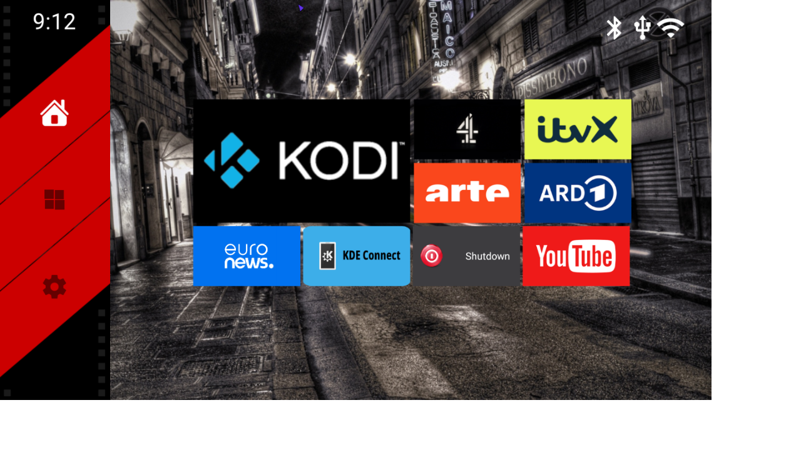

# KodiProxy

## Android TV boxes - Replacing the rebranded Kodi - AliceUX

Older rooted TV boxes allowed you to do this but the original launcher tile banner was fixed, e.g. 'KD Play'. On the other hand, AliceUX allows setting any tile to launch Kodi but shows the banner as 'AliceUX'. Presumably a fallback position when something like ic_<rebranded_kodi_name>.png is no longer available.

KodiProxy is a minimal app that just launches Kodi, then closes. Since the app label is KodiProxy, AliceUX no longer associates it with Kodi and the Kodi logo, from KodiProxy's resources, is displayed.

| Tile set to Kodi ​​​​​​​                  | Tile set to proxy                            |
| :--------------------------------: | :------------------------------------------: |
|  |  |

A release APK is available [here](releases/tag/v1.0).

KodiProxy is based on guidance and template code from [ChatGPT (OpenAI)](https://chatgpt.com/). The Kodi logo, © the [Kodi Foundation](https://kodi.wiki/view/XBMC_Foundation), is used in accordance with [Official:Visual Identity Guidelines](https://kodi.wiki/view/Official:Visual_Identity_Guidelines).
